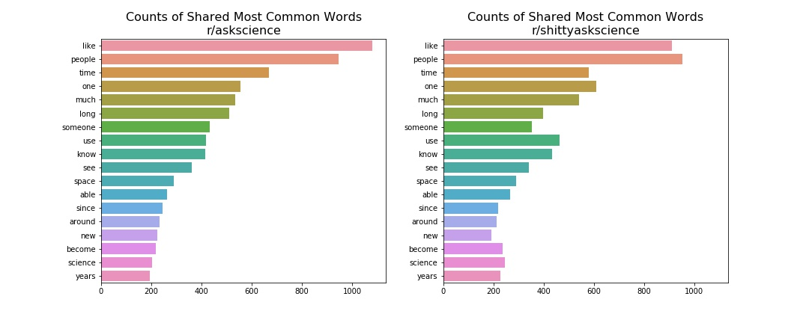
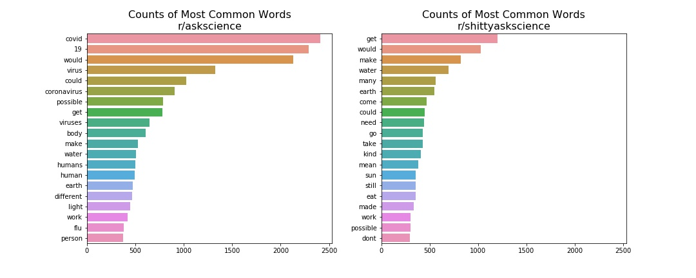

# Introduction to NLP with SciKit Learn: Subreddit Classification
## Lee Littlejohn
#### April 24, 2020
---

**DISCLAIMER:** All materials in this repository have potentially offensive or lewd language. Such is language as it is naturally spoken, and, this being the internet, such is language as typed by online savages.

---

## Goal

To build a series of classification models for predicting, given a reddit post's title, which subreddit the post belongs in. For the purposes of this exploration into Natural Language Processing, these models will attempt to accurately classify reddit posts into either **r/askscience** or **r/shittyaskscience**.

Humor, as a highly subjective concept, can sometimes be difficult for humans to understand _in_ context, so these models attempt to classify language _out_ of context using only an analysis of vocabulary (the Bag-of-Words approach). Providing minimal context via the creation and inclusion of bi-grams (two-consecutive-word phrases) and collocated bi-grams to these models had a negative effect on performance for this corpus, and these features therefore have been removed from the final version of this repository.

To understand the nuance required for this particular classification task, let's take a look at the descriptions of each subreddit. 

From the **r/askscience** guidelines: 

**AskScience** _is a forum for answering science questions. It aims to promote scientific literacy by helping people understand the scientific process and what it can achieve._

An example post from **r/askscience**:

_'Why is nuclear fusion so much harder to achieve than nuclear fission?'_

From the **r/shittyaskscience** sidebar:

_Do you have a question that mainstream science refuses to answer? Are your theories and experiments so bizarre that sensible people tell you they will never be published? Do you need help building a doomsday machine, or shopping for a monstrous assistant? Then you've come to the right place! The esteemed panelists at_ **Shitty Ask Science** _might be the only people who are willing to help you!_

An example post from **r/shittyaskscience**:

_'Which animal do guinea pigs use for their experiments?'_

Based on these descriptions and examples, we might think that context is everything, especially once we recognize that r/shittyaskscience is a purpose-built _parody_ of r/askscience. So, ignoring all structural tags and signifying data associated with a reddit post, to what extent can a BoW approach in SciKit Learn accurately classify posts based on titles alone? Which words are the most divisive between the two classes? Can a BoW model classify some posts that may be misclassified by a human _because_ of context?

## Data Collection and Cleaning

The post titles for both subreddits were collected using the [Pushshift Reddit API](https://github.com/pushshift/api), which allows for pulling up to 500 posts per request with numerous search parameters. Two notebooks in this repository contain the code used to gather data. In [InitialDataCollection](./InitialDataCollection.ipynb), 20,000 posts per subreddit were pulled beginning 4/18/20 12:23:31 (a timestamp assigned to the variable "time_anchor"), working backwards. In [MoreDataCollection](./MoreDataCollection.ipynb), parameters can be adjusted to pull posts beginning from time_anchor and working forwards. As of this writing, [MoreDataCollection](./MoreDataCollection.ipynb) has been run to pull in posts between 4/18/20 and 4/23/20 17:12:00 for a total of 42,598 posts to be cleaned and manipulated in the third and final notebook in this repository, [EDAandModels](./EDAandModels.ipynb). The raw data from the Pushshift API is located in this repository as well, in [b4timeanchor.csv](./data/b4timeanchor.csv) and [aftertimeanchor.csv](./data/aftertimeanchor.csv).

In the third and final notebook in this repository, [EDAandModels](./EDAandModels.ipynb), both .csv files are concatenated to one single Pandas dataframe, subsequently pruned of superfluous columns. Reddit is filthy with spam, ads, and posts removed from view by moderators that break particular rules. Much of this noise makes its way through the Pushshift API and must be dealt with in Pandas. After dropping duplicates and as much noise as possible, 38,170 posts remain to analyze.

## EDA

The posts from these two subreddits are virtually identical in structure; they share similar distributions for both post lengths and word lengths, so the exploratory analysis for this data primarily focused on investigating individual word use frequencies. As most of these posts are questions, likely respresented in similar ratios in each subreddit, certain question words like "why" and "how" will likely impart no meaning when classifying. SciKit Learn's CountVectorizer tokenizes and counts words, so it was used hunt down extra stopwords unique to this corpus instead of manually breaking every document apart and counting tokens.

Here corpus-specific stopwords have been isolated. Only words used in both classes (subreddits) whose percent difference in frequency usage is less than 20%, that is, only words with similar word counts were added to a list of custom stop words.

The CountVectorizer documentation warns about using custom stop words, as they will not be subjected to the vectorizer's internal preprocessing steps. All stop words needed to be stemmed manually with the NLTK PorterStemmer and appended to a master list of stop words for thorough testing.

Here the most commonly used words per subreddit can be seen, _not_ including the custom stop words.

Clearly the effect of the Coronavirus pandemic can be seen in the most commonly used words in **r/askscience**. These pandemic-related words will prove to be very significant to the models.

## Modeling

To fully utilize the power of SciKit Learn's CountVectorizer and TFIDFVectorizer, and therefore fully utilize GridSearchCV, a few small pieces of code needed to be collected to pass in to the vectorizers as possible choices for hyperparameters. Those were the list of custom stop words generated earlier, a regex pattern in order to ignore numbers, and a small stemming function implementing the NLTK PorterStemmer. This was each type of model could be tested with and without the custom stop words, tested with the default regex pattern for tokenizing and the pattern to ignore numbers, and tested with words both stemmed and not stemmed. A lemmatizer was also tested but it decreased overall model performance and was omitted from this analysis.

After binarizing the target and splitting the data into training and testing sets, 9 types of models were trained with varying success, using one, the other, or both vectorizer objects. Pipelines and GridSearches were used to tune hyperparameters. Only the best hyperparameters remain as options in the notebook. Model performance was measured with a simple metric-reporting function, returning 5-fold-validated training accuracy, testing accuracy, sensitivity, specificity, and a plot of the ROC curve. Final results with optimized hyperparameters are shown for each model in the table below.

|Model|Training Accuracy|Testing Accuracy|Sensitivity|Specificity|ROC AUC Score|
|---|---|---|---|---|---|
|K-Nearest Neighbors|.666|.671|.382|.939|.74|
|Multinomial Naive Bayesb|.823|.827|.785|.866|.90|
|Gaussian Naive Bayes|.754|.750|.646|.847|.79|
|Complement Naive Bayes|.825|.830|.792|.865|.90|
|Logistic Regression|.826|.830|.799|.858|.91|
|Ridge Classifier|.826|.832|.808|.855|.91|
|Perceptron Classifier|.784|.786|.795|.777|.87|
|Support Vector Classifier|.823|.826|.791|.859|.91|
|XGBoost Classifier|.815|.817|.780|.852|.90|

With a different random seed set for the train/test split, the scoring metrics for the MultinomialNB, ComplementNB, Logistic Regression, Ridge Classifier, and SVClassifier all vary within a hundredth decimal place of each other, so choosing a "best" model is arbitrary between them. For interpretable coefficients (inferential analysis), only the Logistic Regression model will be used going forward.

## Most Influential and Divisive Words

The most influential words and their associated increase in odds of their presences resulting in a classification of **r/askreddit** are below. The "Odds" have been calculated by raising Euler's number to a power equal to the coefficient generated by the model.

|Odds| Word|
|---|---|
| 702.4 | covid |
| 463.7 | viruses |
| 405.6 | 19 |
| 305.4 | virus |
| 167.6 | coronavirus |
| 104.8 | covid19 |
| 67.8 | pandemic |
| 38.2 | masks |
| 36.7 | vaccine |
| 34.2 | affect |

Coronavirus-related words have the most influence in this model, although this still results in misclassifications. Some posts in **r/shittyaskscience** including Coronavirus-related words were misclassified as belonging to **r/askscience**. Some of the words most associated with **r/shittyaskreddit** are, perhaps unsurprisingly, "shit, poop, sex, fart," etc., although some posts from **r/askscience** were misclassified as belonging to **r/shittyaskscience**.

## Misclassifications

Below some actual posts included in this data can be seen. Briefly reading over these titles and their classification statuses (true positive, false positive, true negative, flase negative) should illuminate how improving on these BoW models with this data may be impossible. 

#### True Positives (predicted r/askscience, truly in r/askscience)

- This is a kinda silly question but when warming food in a microwave, what keeps plates, napkins and other common items that we put in there from becoming the same temp as our food and potentially burning up?

- How does a waste disposal pyrolysis machine work?

- Why does spontaneous radioactive decay happen?

- Can someone with immunity to COVID-19 spread the illness to other people?

- So there’s sleep debt when people are sleep deprived, but is there a sleep “savings” if you sleep a lot?

- Why is a room temperature of 20C chilly in the winter but warm in the summer?

- Is there an evolutionary advantage to having an internal monologue?

- Could a solar probe's shadow darken any significant part of the earth?

- Why do some farts feel hotter than others? (TP even with the word "fart")

- Are there emotions humans can't feel?

#### False Positives

- If Oreo is milk's favorite cookie, what are some of milk's other favorite things?

- Could I continue to let bread dough rise for infinite bread?

- How big would the wingspan of a T-Rex have to be for it to be able to fly?

- What frame rate am I seeing the world at?

- Can somebody explain osmosis in middle school level terms? (easily misclassifiable)

- What non food material can I eat to counteract the time dilation effects of fasting too fast?

- Am I more likely to suffocate in a mine or be suffocated by a mime?

#### True Negatives

- If light travels fast and I travel light then why the hell is my plane late?

- Are nukes bad for the environment? Asking for a friend.

- If kinetic energy is converted into thermal energy, how hard do I have to slap a chicken to cook it?

- Where are all the bees really going?

- Where are my shoes?

- This mirror at my local pharmacy appears to turn things upside down as well as invert it left to right. Has there been any breakthroughs in making mirrors of late?

- Is ice that’s made on the ocean salty? (a person might have classified this as positive)

- Do crabs think fish can fly?

#### False Negatives

- Why do birds sing so fucking much in the morning? (the word "fuck" generally kept posts in the 0 class)

- What caused the equatorial bulge of 14 miles? (the word "bulge" may have had some similar effect here)

- If you are sitting on a chair and you have the strength to lift the chair along with you, would you be able to float in air?

- How does steam remove wrinkles?

- At what speed does moving through the air stop cooling you down and start warming you up?

- I’ve awaken coughing, farting, or snoring, but why I have I never awaken myself sneezing? (model thrown off by "farting")

## Conclusions

Language and humor are _highly_ subjective, and I personally misclassified some of these posts while testing myself blindly. These models may very well classify these posts just as well as a human, if not better than some. Taking note of how many different models converged to the same performance metrics, we can conclude that a little better than 4 out of 5 is the best these models can do.

Due to the current pandemic, the frequent questions posed to **r/askscience** concerning the Coronavirus have likely skewed the results. Coronavirus-related words hold great sway in these models. Also, classically inappropriate or childish words also determine a post's class.

To partially quote the HBO television show "WestWorld," these machine learning models may not have a sense of humor, but if you can't tell, does it matter?

## Further Exploration

Although an effort was made to reduce noise (ads, spam, etc.), this data is far from noise-free. Some posts are just one single word and some spam made it through the filters. Reducing this noise further should result in better performance. Data sampled from before the pandemic would also likely result in very different scoring metrics. More complicated models (such as neural nets) would also likely generated more accurate predictions.

For better performance, the best models should be given to SciKit Learn's VotingClassifier (an ensemble method) to smooth out model-specific misclassifications. Those particular posts may have a clear pattern between different models, and this analysis did not dive in to that.

#### References

"Applied Text Analysis with Python" by Benjamin Bengfort, Tony Ojeda, & Rebecca Bilbro

"Feature Engineering for Machine Learning" by Alice Zheng & Amanda Casari

"Doing XGBoost hyper-parameter tuning the smart way — Part 1 of 2" by Mateo Restrepo, https://towardsdatascience.com/doing-xgboost-hyper-parameter-tuning-the-smart-way-part-1-of-2-f6d255a45dde

Special thanks to the developers and scientists at SciKit Learn for providing excellent documentation.